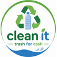
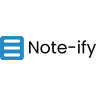

## what i do

i make games in unity, and apps that do something useful with live data.

most of these started as something i wanted to know the answer to, so there is usually a part where i go back and check the thing actually works.

## games

<table width="100%">
<tr>
<td width="25%" align="center"> <b><a href="https://github.com/huznot/Let-There-Be-Light">let there be light</a></b> first person story game. <a href="https://youtu.be/E0pImV2HVu8">playthrough</a></td>
<td width="25%" align="center"> <b><a href="https://github.com/huznot/1v1-Basketball">1v1 basketball</a></b> lebron vs jordan, one keyboard, first to 10</td>
<td width="25%" align="center"> <b><a href="https://github.com/huznot/Museum-Game">museum</a></b> black history museum. <a href="https://id-game-delta.vercel.app">play in browser</a></td>
<td width="25%" align="center"> <b><a href="https://github.com/huznot/physics-sandbox">dynamics sandbox</a></b> live velocity, acceleration and force readouts</td>
</tr>
</table>

## apps

<table width="100%">
<tr>
<td width="50%" valign="top" align="center"> <b><a href="https://github.com/huznot/MOSI">mosi</a></b> one outdoor risk score for any manitoba community, from twelve live government feeds. <a href="https://www.youtube.com/shorts/96YkiCytAJQ">walkthrough</a></td>
<td width="50%" valign="top" align="center"> <b><a href="https://github.com/huznot/CleanIt">cleanit</a></b> point your camera at some trash, find out where it goes, drop it off, get points that spend at winnipeg businesses</td>
</tr>
<tr>
<td width="50%" valign="top" align="center"> <b><a href="https://github.com/huznot/frugal-app">frugal</a></b> photograph a product, gemini works out what it is, then it finds the nearest store selling it cheaper</td>
<td width="50%" valign="top" align="center"> <b><a href="https://github.com/huznot/Noteify">noteify</a></b> a place to upload and search class notes. no framework, so i understood every line</td>
</tr>
</table>

mosi was built with mentorship from dr. michael drebot, former director of zoonotic diseases at canada's national microbiology lab. the validation folder reruns the scoring against real west nile surveillance records to see if the numbers hold up. it won a manitoba schools science symposium silver medal and the canadian meteorological and oceanographic society award for environmental science.

cleanit came out of a canu and kahanee design lab, kept going at shad, has taken over $3.5k in funding and has been pitched to the mayor of winnipeg. it is built around wahkohtowin, the cree understanding that all living things are related and that being related carries responsibility.

## research

<table width="100%">
<tr>
<td width="50%" valign="top" align="center"> <b><a href="https://github.com/huznot/SAPBert">icd crosswalk</a></b> hospital records are full of diagnosis codes that got retired years ago. this matches them to the current ones automatically</td>
<td width="50%" valign="top" align="center"> <b><a href="https://github.com/CodyWallbridge/RAM-Combustion-Engine-Exhibit">combustion engine exhibit</a></b> the kiosk software behind a museum exhibit, four screens and a live display driven from one python backend</td>
</tr>
</table>

<table>
<tr>
<td valign="top"></td>
<td valign="top"></td>
</tr>
</table>

<table>
<tr>
<td valign="top"></td>
<td valign="top"></td>
</tr>
</table>

## reach me

winnipeg, manitoba
